# 💸 Cashy App

A modern Flutter finance application built to help users manage income and expenses with a clean and organized experience 📱✨

Cashy App provides a smooth way to track daily transactions, calculate balances instantly, and manage financial activities using a modern UI 🎨

---

# 💙 About The Project

This project was built to practice real Flutter development concepts through building a complete finance tracking application 🚀

The app focuses on:

* Clean UI Design 🎨
* Smooth User Experience 📱
* Local Data Management 💾
* Dark & Light Mode 🌙
* Organized App Structure 🧩
* Fast Navigation ⚡

The project also helped improve skills in:

* State Management 🧠
* Local Database 📦
* Flutter Architecture 🏗️
* CRUD Operations 🔄
* Responsive Design 📲
* App Navigation 🚀
* Onboarding Flow ✨

---

# 🎥 Demo Preview

Watch Demo Video 🎬

https://www.linkedin.com/posts/salah-hassan66190_flutter-mobiledevelopment-dart-activity-7459676641900883968-XQs8?utm_source=share&utm_medium=member_android&rcm=ACoAAFY2TGMBI-LuRPjN8vwwkj21qlrQwdAev7M

---

# 📱 App Screenshots

<div align="center">


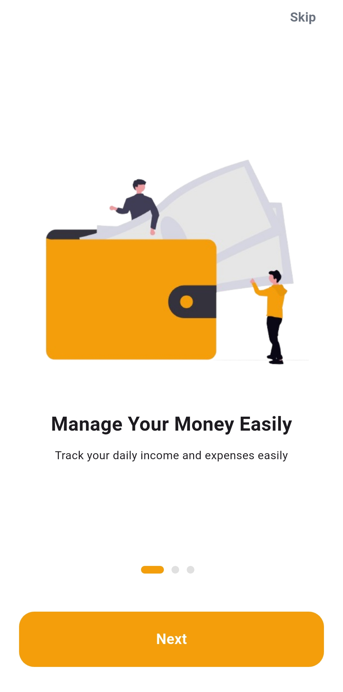
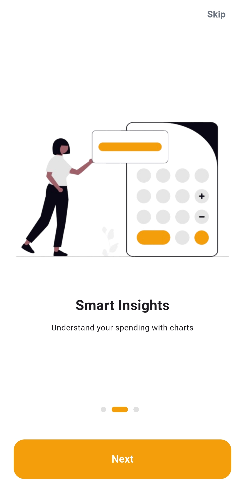

<br/>

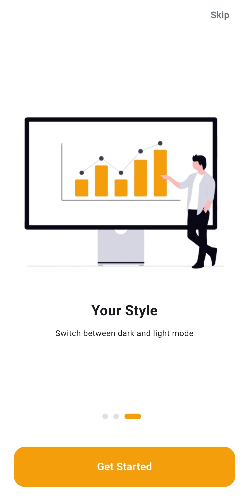
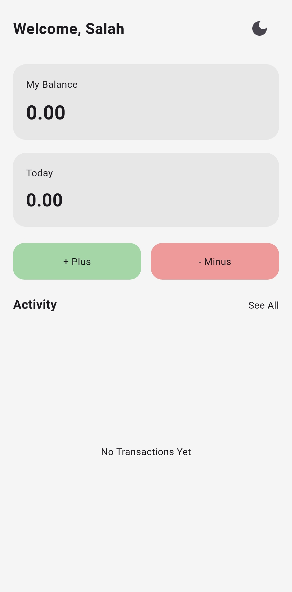
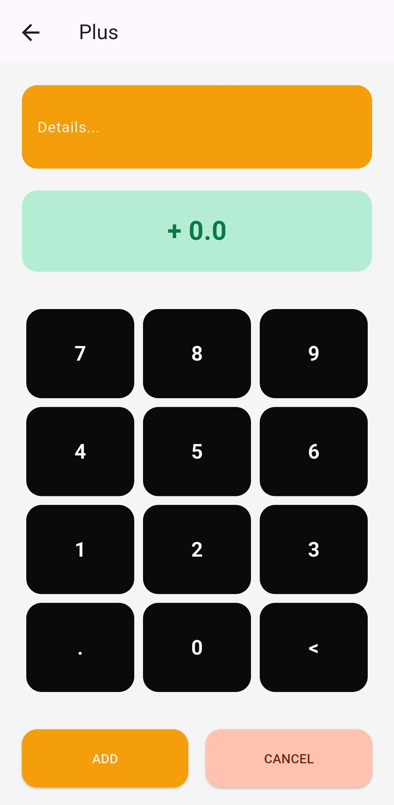

<br/>

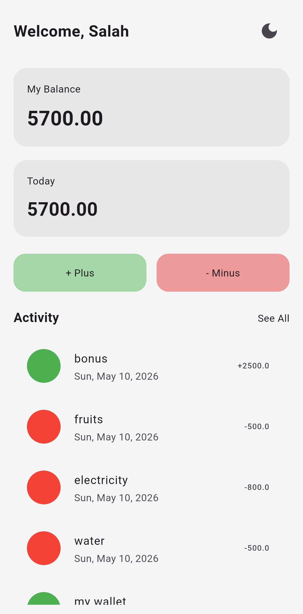
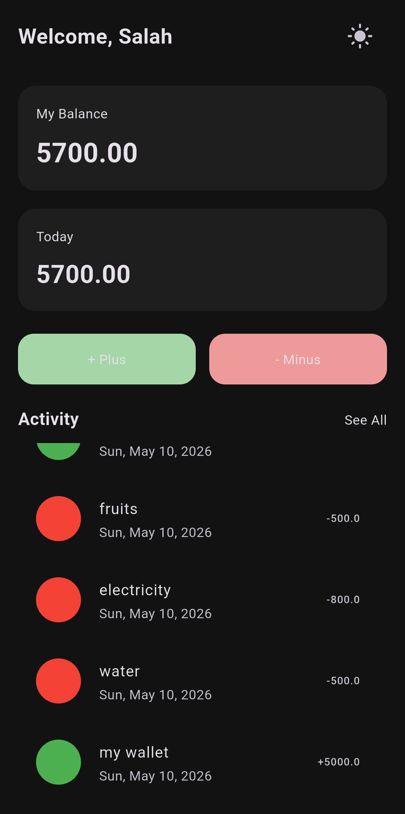
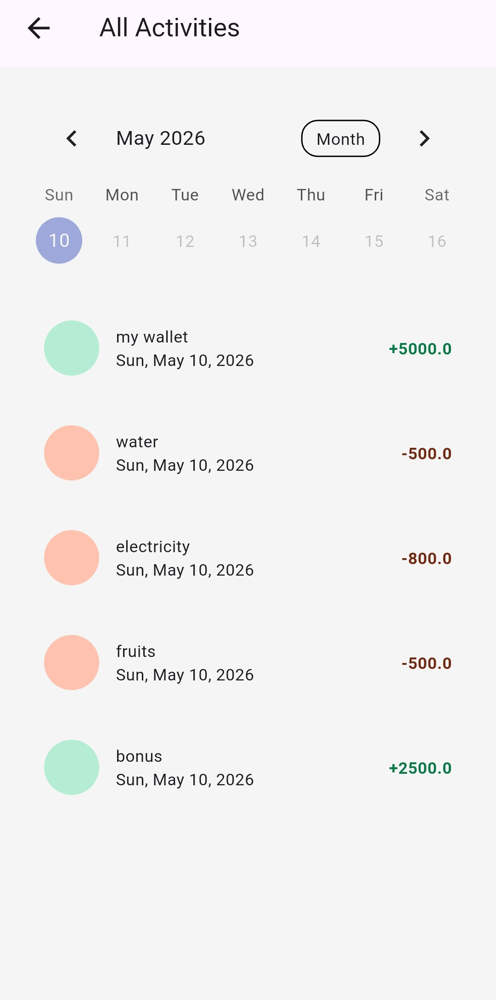

<br/>

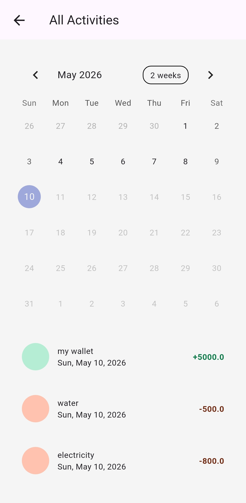
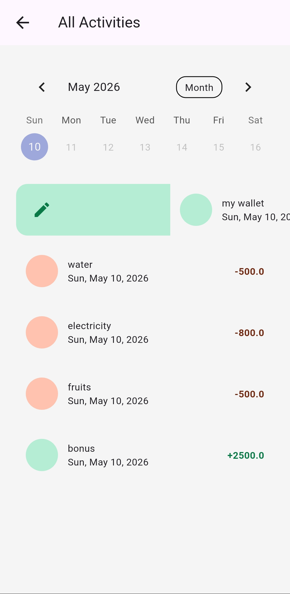
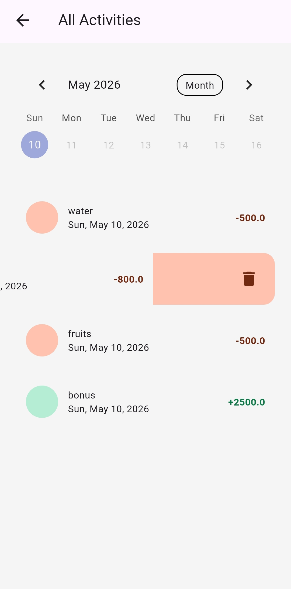

</div>

---

# ✨ Features

* Add new income & expense transactions 💰
* Edit and update transactions ✏️
* Delete transactions 🗑️
* Real-time balance calculation ⚡
* Clean Home Screen UI 🎨
* Dark & Light Mode 🌙
* Splash Screen 🚀
* Onboarding Flow ✨
* Activity History Screen 📚
* Calendar Integration 📅
* Local Database using Hive 📦
* Smooth Navigation 🔄
* Organized Project Structure 🧩
* Responsive Design 📱

---

# 🛠 Tech Stack

## 🚀 Framework & Language

* Flutter
* Dart

## 🧠 State Management

* flutter_bloc
* bloc

## 💾 Local Database

* hive
* hive_flutter

## 📦 Local Storage

* shared_preferences

## 🎨 UI & Utilities

* table_calendar
* intl
* gap
* cupertino_icons

## 🧰 Development Tools

* build_runner
* hive_generator
* flutter_launcher_icons
* flutter_lints

---

# 📂 Folder Structure

```bash id="5xhl8y"
lib/
├── colors/
├── cubit/
│   ├── addCubit/
│   └── fetchCubit/
├── data/
├── models/
├── screens/
│   ├── add/
│   ├── home/
│   ├── onboarding/
│   ├── see_all/
│   └── splach/
├── widgets/
└── main.dart
```

---

# 🚀 Getting Started

Clone the repository 📦

```bash id="u8n97m"
git clone https://github.com/SalahHassan202/flutter-cashy-app.git
```

Go to project folder 📂

```bash id="k0s6lu"
cd flutter-cashy-app
```

Install dependencies ⚙️

```bash id="8tnn81"
flutter pub get
```

Run the app ▶️

```bash id="jlwm151"
flutter run
```

---

# 👨‍💻 Author

Salah Hassan

🔗 GitHub
https://github.com/SalahHassan202
